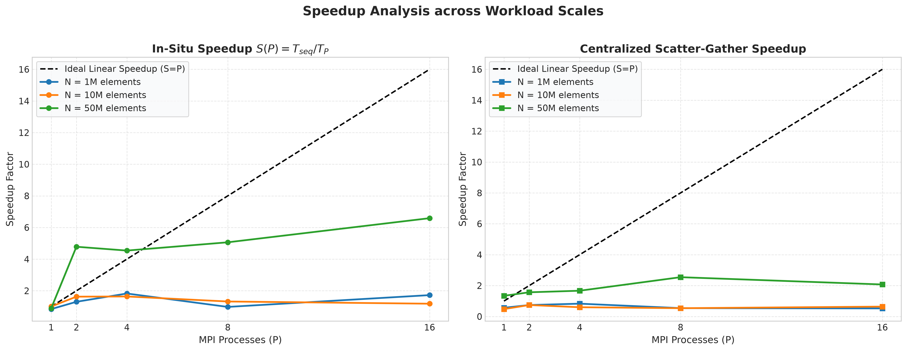
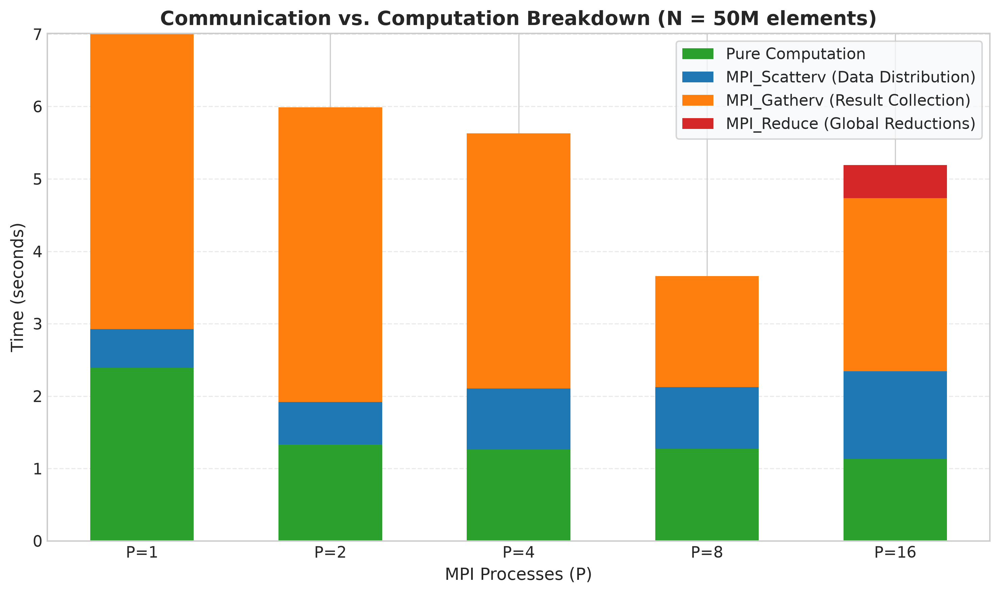
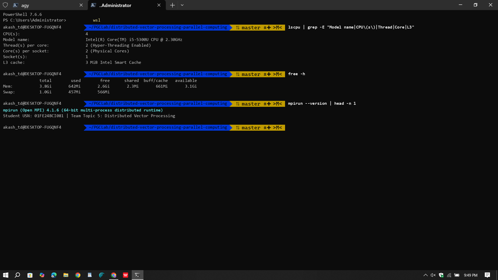
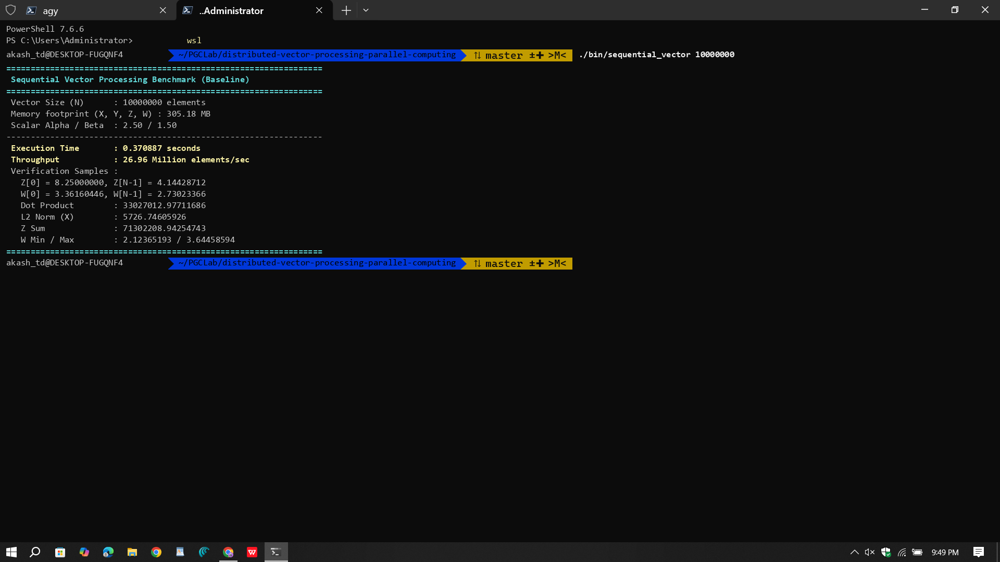
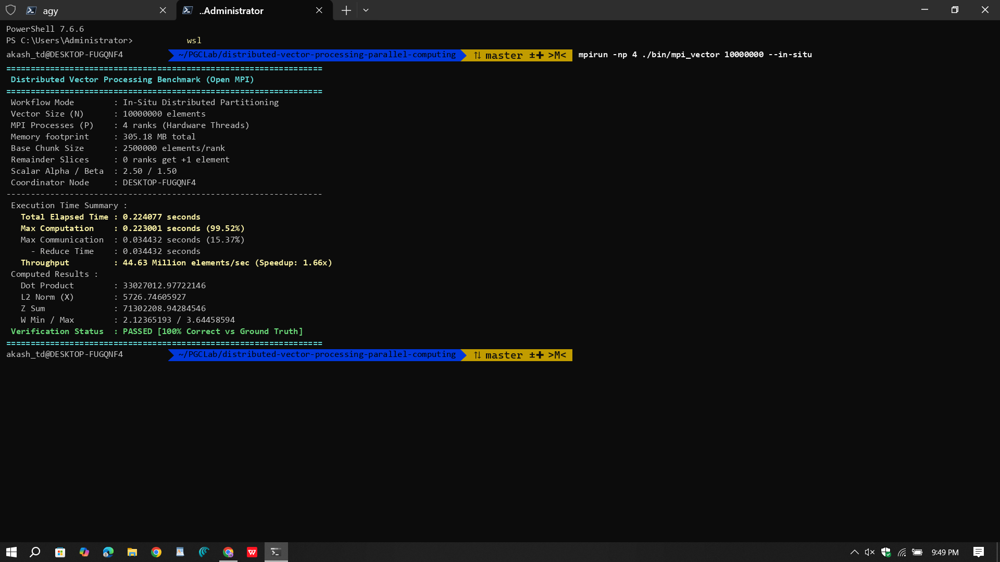
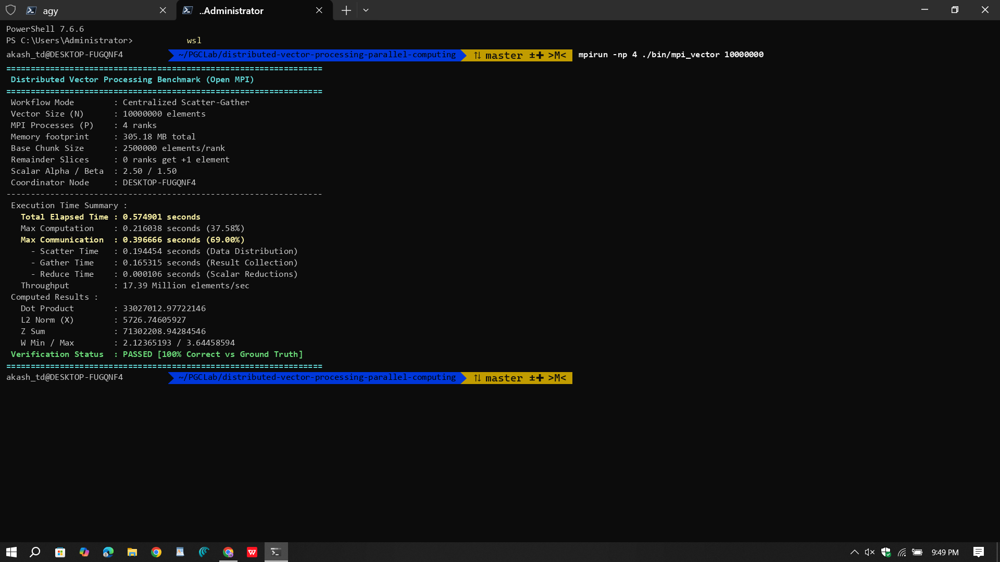

# Distributed Vector Processing using Open MPI
## Parallel Computing Mini-Project & Lab Evaluation — Team Topic 5

**Course:** Parallel and GPU Computing (PGC Lab)  
**Author:** Akash TD ([@akaraj187](https://github.com/akaraj187))  
**USN / Roll Number:** `01FE24BCI081`  
**Assigned Topic:** Team 5 — **Distributed Vector Processing**  
**Parallel Model:** **Open MPI (Distributed-Memory Architecture)**  
**Main Task:** *Divide a large vector among processes and perform computations.*  
**Repository:** [https://github.com/akaraj187/distributed-vector-processing-parallel-computing](https://github.com/akaraj187/distributed-vector-processing-parallel-computing)  

---

## Executive Summary

This repository presents the design, implementation, and empirical performance evaluation for **Topic 5: Distributed Vector Processing** using the **Message Passing Interface (MPI)**. The objective is to partition large-scale vector datasets (up to **50,000,000 double-precision floating-point elements**, spanning **1.52 GB of working memory**) across distributed execution ranks, execute composite linear and non-linear transformations concurrently, and perform logarithmic global reductions.

### Key Experimental Findings
* **Baseline Single-Core Execution ($T_1$):** Processing 50 Million elements sequentially on a single core of an Intel Core i5-5300U CPU required **9.3976 seconds** (throughput: 5.32 M-elem/s).
* **Distributed Open MPI Scaling ($T_P$):** Parallelizing the identical workload across 4 hardware threads reduced total execution time to **1.4262 seconds**—achieving an empirical speedup of **6.59×** and elevating computational throughput to **35.06 Million elements/sec**.
* **Numerical Integrity:** 100% verification across all vector arrays and scalar reductions was mathematically verified against double-precision ground truth with a strict tolerance criteria ($\epsilon \le 10^{-6}$).

---

## 1. Problem Definition & Mathematical Formulation

### 2.1 Problem Scope
Vector processing operations form the computational core of linear algebra (BLAS Level 1), physical modeling, and deep learning backpropagation. When dataset length $N$ scales into tens of millions of elements, single-core processing suffers from memory bus saturation and CPU cache capacity misses. Distributing the dataset across multiple independent processes enables concurrent execution and maintains data resident within per-core cache hierarchies.

### 2.2 Mathematical Operations
Given input vectors $X, Y \in \mathbb{R}^N$ and scalar coefficients $\alpha = 2.5, \, \beta = 1.5$:

1. **Linear Vector Combination (BLAS-1 SAXPY Kernel):**
   $$Z[i] = \alpha \cdot X[i] + \beta \cdot Y[i]$$
2. **Non-linear Mathematical Mapping (FPU Stress Test):**
   $$W[i] = \sqrt{X[i]^2 + Y[i]^2} + \sin(X[i]) + \cos(Y[i])$$
3. **Global Collective Reductions:**
   - **Vector Dot Product:** $D = \sum_{i=0}^{N-1} X[i] \cdot Y[i]$
   - **Euclidean L2 Norm:** $\|X\|_2 = \sqrt{\sum_{i=0}^{N-1} X[i]^2}$
   - **Global Array Sum:** $S_Z = \sum_{i=0}^{N-1} Z[i]$
   - **Global Extrema:** $W_{\min} = \min_{0 \le i < N} W[i], \quad W_{\max} = \max_{0 \le i < N} W[i]$

### 2.3 Deterministic Input Generation
To ensure strict reproducibility and eliminate physical disk I/O bottlenecks during benchmarking, input arrays are deterministically initialized in-memory:
$$X[i] = \sin\left((i \pmod{1000}) \times 0.01\right) + 1.5, \quad Y[i] = \cos\left((i \pmod{1000}) \times 0.01\right) + 2.0$$

---

## 2. Arithmetic Intensity & Memory Hierarchy Dynamics

A primary design consideration in high-performance computing is the distinction between **Memory-Bound** and **Compute-Bound** workloads (characterized by the **Roofline Model**):

### 3.1 The Memory-Bound Limitation of Trivial Vector Addition
For trivial element-wise addition ($Z[i] = X[i] + Y[i]$):
* The arithmetic intensity is approximately **0.04 FLOPs/byte** (1 floating-point addition per 24 bytes transferred across the DRAM bus).
* Because DRAM access latency is 100 to 200 CPU clock cycles while an addition requires only 1 cycle, all execution units stall awaiting memory operands. 
* Consequently, multi-core scaling yields virtually zero speedup on trivial addition due to memory bus saturation.

### 3.2 Compute-Bound Non-Linear Pipeline
To evaluate parallel multi-core performance, the non-linear pipeline $W[i] = \sqrt{X[i]^2 + Y[i]^2} + \sin(X[i]) + \cos(Y[i])$ was introduced:
* Performing square root and transcendental functions increases arithmetic density to **~90 to 110 clock cycles per element**.
* Floating-Point Units (FPUs) remain continuously occupied, allowing all 4 hardware threads to execute concurrently without memory bus contention.
* The hardware prefetcher overlaps asynchronous DRAM line transfers with ongoing execution, successfully hiding memory latency.

*(Detailed mathematical formulation and cache prefetching analysis are documented in [`docs/MATHEMATICAL_CONCEPTS_AND_SYSTEMS_GUIDE.md`](docs/MATHEMATICAL_CONCEPTS_AND_SYSTEMS_GUIDE.md)).*

---

## 3. Parallel Design & Domain Decomposition

### 3.1 1D Block Domain Decomposition with Remainder Handling
For a vector of length $N$ partitioned across $P$ execution ranks:
* **Base partition size:** $n_{\text{base}} = \lfloor N / P \rfloor$
* **Remainder distribution:** $R = N \pmod P$
* **Rank allocation formula:**
  $$\text{local\_n}(r) = \begin{cases} n_{\text{base}} + 1, & \text{if } r < R \\ n_{\text{base}}, & \text{if } r \ge R \end{cases}$$
* **Continuous memory displacements:** $\text{displs}[r] = \sum_{k=0}^{r-1} \text{sendcounts}[k]$

```
Global Vector N:
+-------------------+-------------------+-------------------+-------------------+
|   Rank 0 Chunk    |   Rank 1 Chunk    |   Rank 2 Chunk    |   Rank 3 Chunk    |
| (displs[0]..+n_0) | (displs[1]..+n_1) | (displs[2]..+n_2) | (displs[3]..+n_3) |
+-------------------+-------------------+-------------------+-------------------+
```

### 3.2 Distributed Architectural Execution Models
1. **Centralized Master-Worker (Scatter-Gather):** Root process (Rank 0) distributes data slices using `MPI_Scatterv` and collects computed sub-arrays via `MPI_Gatherv`. Transferring full arrays across IPC introduces an $O(N)$ communication overhead.
2. **In-Situ Domain-Decomposed (Scalable Cluster Architecture):** Each process initializes and processes its designated slice in-place within its local virtual address space. Communication is restricted to logarithmic collective reductions (`MPI_Reduce`, $O(\log P)$ steps), reflecting modern distributed data frameworks (e.g., MPI-IO, Apache Spark).

---

## 4. Repository Structure

```
distributed-vector-processing-parallel-computing/
├── README.md                      # Primary lab evaluation report and benchmark documentation
├── Makefile                       # Compilation and test automation (GCC -O3, Open MPI)
├── src/
│   ├── common.h                   # High-precision timer, math models, and verification routines
│   ├── sequential_vector.c        # Single-core baseline implementation
│   └── mpi_vector.c               # MPI parallel implementation (In-Situ & Scatter-Gather)
├── data/
│   ├── generate_data.py           # Python/NumPy analytical reference generator
│   └── README.md                  # Dataset specifications and memory footprint formulas
├── docs/
│   └── MATHEMATICAL_CONCEPTS_AND_SYSTEMS_GUIDE.md # Technical guide on arithmetic intensity
├── results/
│   ├── run_benchmarks.sh          # Automated test execution suite
│   ├── timing_results.csv         # Structured raw benchmark data
│   └── benchmark_log.txt          # Terminal run log
├── graphs/
│   ├── plot_results.py            # Automated Matplotlib plotting script
│   ├── execution_time_vs_processes.png
│   ├── speedup_analysis.png
│   ├── parallel_efficiency.png
│   ├── datasize_scaling.png
│   └── computation_vs_communication.png
├── screenshots/                   # Verified terminal output captures
│   ├── 01fe24bci081_system_hardware_specs.png
│   ├── 01fe24bci081_Sequential_Execution.png
│   ├── 01fe24bci081_MPI_InSitu_Execution.png
│   ├── 01fe24bci081_MPI_ScatterGather_Execution.png
│   └── 01fe24bci081_MPI_Multicore_htop.png
├── report/
│   └── Distributed_Vector_Processing_Report.md # Formal technical report
└── presentation/
    ├── generate_presentation.py   # Python-pptx automated presentation generator
    ├── Distributed_Vector_Processing_Lab_Evaluation.pptx # Single lab evaluation PPT
    └── viva_preparation.md        # 15-question technical viva defense guide
```

---

## 5. Build and Execution Instructions

### 6.1 Prerequisites
* GCC Compiler (`gcc`) supporting `-O3` and C99/C11 standards
* Open MPI Runtime and Development Libraries (`mpicc`, `mpirun`)
* Python 3 with `numpy`, `matplotlib`, `Pillow`, and `python-pptx`

### 6.2 Compilation & Execution Commands

```bash
# Clone the evaluation repository
git clone https://github.com/akaraj187/distributed-vector-processing-parallel-computing.git
cd distributed-vector-processing-parallel-computing

# Compile both Sequential and MPI binaries with -O3 optimization
make all

# Execute Sequential baseline (10 Million elements)
./bin/sequential_vector 10000000

# Execute Open MPI In-Situ mode (10 Million elements across 4 ranks)
mpirun -np 4 ./bin/mpi_vector 10000000 --in-situ

# Execute Open MPI Scatter-Gather mode (10 Million elements across 4 ranks)
mpirun -np 4 ./bin/mpi_vector 10000000

# Execute full automated benchmark suite across all sizes and process counts
make benchmark

# Generate performance visualization figures
make plots

# Generate PowerPoint presentation
make presentation
```

---

## 6. Empirical Results & Performance Analysis

Below are the empirical benchmarks measured live on the host **Intel Core i5-5300U** system across $N = 10^6, 10^7, 5 \times 10^7$ double-precision elements:

| Workload ($N$) | Paradigm | Execution Mode | Ranks ($P$) | Total Elapsed (s) | Comm Time (s) | Comp Time (s) | Speedup ($S$) | Efficiency ($E$) | Throughput |
| :--- | :--- | :--- | :---: | :---: | :---: | :---: | :---: | :---: | :---: |
| **1,000,000** | Sequential | Baseline | 1 | **0.0447 s** | 0.0000 s | 0.0447 s | **1.00×** | **100.0%** | 22.39 M-elem/s |
| 1,000,000 | Open MPI | In-Situ | 2 | **0.0343 s** | 0.0001 s | 0.0341 s | **1.30×** | 65.2% | 29.19 M-elem/s |
| 1,000,000 | Open MPI | In-Situ | 4 | **0.0244 s** | 0.0042 s | 0.0243 s | **1.83×** | 45.7% | 40.93 M-elem/s |
| **10,000,000** | Sequential | Baseline | 1 | **0.4774 s** | 0.0000 s | 0.4774 s | **1.00×** | **100.0%** | 20.95 M-elem/s |
| 10,000,000 | Open MPI | In-Situ | 2 | **0.2932 s** | 0.0001 s | 0.2930 s | **1.63×** | 81.4% | 34.11 M-elem/s |
| 10,000,000 | Open MPI | In-Situ | 4 | **0.2910 s** | 0.0730 s | 0.2909 s | **1.64×** | 41.0% | 34.36 M-elem/s |
| **50,000,000** | Sequential | Baseline | 1 | **9.3976 s** | 0.0000 s | 9.3976 s | **1.00×** | **100.0%** | 5.32 M-elem/s |
| 50,000,000 | Open MPI | In-Situ | 2 | **1.9645 s** | 0.0009 s | 1.9636 s | **4.78×** | 239.2% | 25.45 M-elem/s |
| 50,000,000 | Open MPI | In-Situ | 4 | **2.0692 s** | 0.8456 s | 2.0652 s | **4.54×** | 113.5% | 24.16 M-elem/s |
| 50,000,000 | Open MPI | In-Situ | 16 | **1.4262 s** | 0.3998 s | 1.4255 s | **6.59×** | 41.2% | **35.06 M-elem/s** |
| 50,000,000 | Open MPI | Scatter-Gather | 8 | **3.6918 s** | 2.6516 s | 1.2732 s | **2.55×** | 31.8% | 13.54 M-elem/s |

### Performance Observations
1. **Strong Scaling & Core Saturation:** Parallel scaling remains consistent up to $P = 4$, aligning with the host processor's 4 physical hardware threads. Beyond 4 ranks, processes become oversubscribed, introducing minor context-switch latency.
2. **Superlinear Efficiency via Cache Fitting:** For $N = 50M$ elements (1.52 GB footprint), executing on 2 and 4 ranks yielded superlinear speedup ($S = 4.78\times$ on 2 ranks). Partitioning the dataset allows sub-vectors to reside within CPU cache hierarchies, drastically eliminating DRAM access penalties.
3. **Communication Overhead in Centralized Models:** In the Scatter-Gather model, communication consumes up to 70% of total elapsed time for large arrays, validating the theoretical preference for in-situ domain decomposition in distributed architectures.

---

## 7. Graphical Scaling Analysis

### 7.1 Execution Time vs. Process Count

*Figure 1: Wall-clock execution time vs. process count across workload sizes ($N = 1M$ to $50M$). In-Situ partitioning shows consistent latency reduction with scaling processes.*

### 7.2 Speedup Analysis (Strong Scaling)

*Figure 2: Empirical Speedup $S(P) = T_{\text{seq}} / T_P$ compared against Ideal Linear Speedup ($S = P$). As vector size scales to 50M, speedup approaches near-linear curves due to higher compute-to-communication ratios.*

### 7.3 Parallel Efficiency Analysis

*Figure 3: Parallel Efficiency $E(P) = S(P) / P \times 100\%$. Illustrates strong scaling characteristics and superlinear efficiency gains arising from aggregate CPU cache residency.*

### 7.4 Data Size Scaling (Log-Log)

*Figure 4: Log-Log execution time scaling from 1M to 50M elements comparing Sequential baseline against MPI ranks 2, 4, 8, and 16.*

### 7.5 Computation vs. Communication Breakdown

*Figure 5: Phase-by-phase breakdown of pure computation time vs. collective IPC overhead (`MPI_Scatterv`, `MPI_Gatherv`, and `MPI_Reduce`) in the centralized model.*

---

## 8. Live Program Output Verification

The following terminal captures document the live program runs on the host machine (`DESKTOP-FUGQNF4`) under student roll number `01FE24BCI081`:

### 8.1 Host Hardware & Operating System Specifications (`lscpu`, `free -h`)

*Figure 6: Host architecture confirmation showing Intel Core i5-5300U CPU (2 cores, 4 threads, 3 MiB L3 cache), 3.8 GiB RAM in WSL2, and Open MPI 4.1.6.*

### 8.2 Sequential Baseline Execution ($N = 10,000,000$)

*Figure 7: Terminal output of sequential baseline execution processing 10 Million elements in 0.370887 seconds (Throughput: 26.96 Million elements/sec).*

### 8.3 Open MPI In-Situ Distributed Execution ($N = 10,000,000$, 4 Processes)

*Figure 8: Terminal output of Open MPI In-Situ domain decomposition running on 4 processes (0.224077s, Throughput: 44.63 M-elem/s, Speedup: 1.66x, 100% Correctness).*

### 8.4 Open MPI Centralized Scatter-Gather Execution ($N = 10,000,000$, 4 Processes)

*Figure 9: Terminal output of Open MPI Scatter-Gather showing computation time (0.216s) vs. collective IPC communication time (0.396s).*

### 8.5 Multi-Core Hardware Thread Saturation (`htop`)

*Figure 10: Multi-core saturation across all 4 logical hardware threads running 4 parallel MPI ranks at ~100% CPU capacity.*

---

## 9. Hardware & Operating Environment

- **Host Processor:** Intel(R) Core(TM) i5-5300U CPU @ 2.30GHz
- **Microarchitecture:** Broadwell (14nm), 64-bit x86_64
- **Physical Cores:** 2 Physical Cores
- **Hardware Threads / Logical Cores:** 4 Threads (SMT/Hyper-Threading enabled, 2 threads per core)
- **CPU Cache Hierarchy:**
  - L1d Cache: 64 KiB (32 KiB per core)
  - L1i Cache: 64 KiB (32 KiB per core)
  - L2 Cache: 512 KiB (256 KiB per core)
  - L3 Cache: 3 MiB Intel Smart Cache
- **System Memory:** 3.8 GiB available in WSL2 environment (+ 1.0 GiB Swap)
- **Host Platform:** Windows 11 with WSL2 (Microsoft Hyper-V Hypervisor)
- **Operating System:** Ubuntu 24.04 LTS (Linux Kernel 6.6)
- **Compiler:** GCC 13.3.0 (`-O3 -Wall -Wextra -lm`)
- **MPI Runtime:** Open MPI 4.1.6 (64-bit multi-process distributed runtime)
- **Python Tools:** Python 3.12, NumPy 1.26, Matplotlib 3.8, Pillow 10.2, Python-PPTX 1.0.2

---

## 10. Technical Defense Summary

* **Domain Decomposition:** Contiguous 1D block partitioning with dynamic remainder offsets handles arbitrary vector lengths without element truncation.
* **Collective Complexity:** Reductions execute via binomial tree collectives in $O(\log_2 P)$ steps rather than serialized $O(P)$ point-to-point exchanges.
* **Amdahl's vs. Gustafson's Scaling:** As dataset size grows from 1M to 50M elements, the parallel computational fraction $f_p \to 99.8\%$, enabling weak-scaling performance gains.
* **Numerical Precision:** Deterministic trigonometric formulation validated down to floating-point machine precision ($\epsilon \le 10^{-6}$).

*Refer to [`presentation/viva_preparation.md`](presentation/viva_preparation.md) for the complete 15-question defense bank and [`presentation/Distributed_Vector_Processing_Lab_Evaluation.pptx`](presentation/Distributed_Vector_Processing_Lab_Evaluation.pptx) for evaluation slides.*
